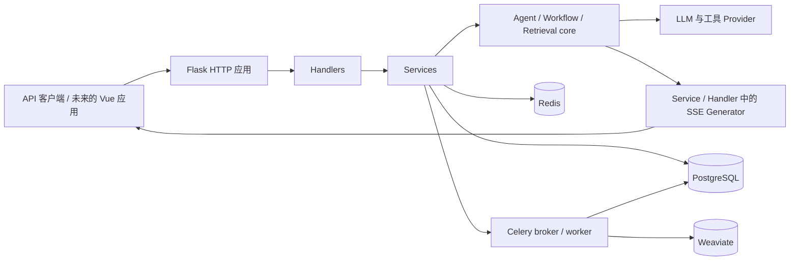

# Trace LLMOps 架构说明

## 系统上下文

Trace LLMOps 对外提供需要认证的管理 API、应用调试 API，以及已发布应用的对话 API。PostgreSQL 保存配置和会话状态，Redis 提供缓存与任务停止标记，Celery 执行文档索引任务，Weaviate 保存向量化后的文档片段。

## 后端分层边界

- `app/http` 创建 Flask 应用和 Injector 容器。
- `internal/router` 将路由绑定到 Handler。
- `internal/handler` 验证 HTTP 输入并组织响应。
- `internal/service` 负责用例、权限、持久化编排和后台任务派发。
- `internal/model` 包含 SQLAlchemy 持久化模型。
- `internal/core` 包含 Agent、Workflow、检索、工具、流式输出和模型 Provider 的运行时抽象。
- `internal/extension` 初始化数据库、Redis、Celery、迁移、登录和日志等集成。

现有 HTTP Schema 使用 Flask-WTF 和 Marshmallow。新增 Core/Runtime 契约统一优先使用 Pydantic v2；只有在明确安排兼容迁移时才调整既有接口。

## Agent 与 SSE 数据流

1. Service 创建消息，并加载已发布或草稿状态的应用配置。
2. `FunctionCallAgent` 在后台线程中运行 LangGraph Graph。
3. Graph Node 将 `AgentThought` 对象写入进程内 Queue。
4. Service 读取 Queue，并在各自的 Generator 中组装 `event:` 和 JSON `data:`。
5. Service 使用后台线程在 Flask Application Context 中保存消息和推理过程。

当前没有统一的 SSE 编码器或正式版本化 `StreamEvent`。事件生成分散在 `app_service.py`、`openapi_service.py`、`workflow_service.py`、`ai_service.py` 和部分 Handler 中。

当前 Queue 位于进程内。Redis 只保存任务归属和停止标记，不保存流式事件。因此一个 Stream 必须留在启动它的 API 进程中，暂不支持多 Worker 共享、重放和断线恢复。

## Celery 数据流

文档新增、更新、删除 Service 通过 Celery 调用索引任务。Worker 进入 Flask Application Context 后调用索引 Service。Celery 的序列化、幂等、重试和重复投递仍需要在后续相关改动中逐项验证，不应假设已经完善。

## 配置与密钥

配置由 Flask Factory 从环境变量加载。只有 `.env.example` 可作为配置项参考；Codex 不应读取或输出 `.env`。当前尚未建立 CI，测试会继承本地配置，因此运行测试前要确认不会连接生产资源或调用付费模型。
