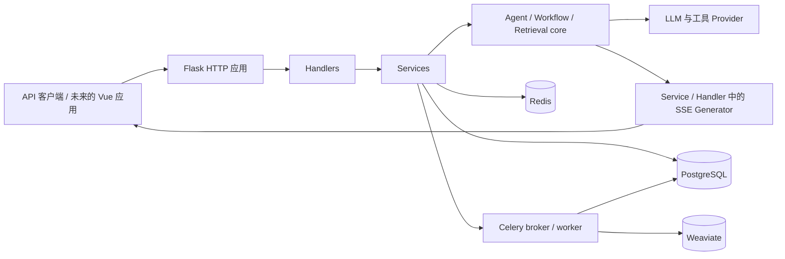

# Trace LLMOps 架构说明

## 系统上下文

Trace LLMOps 对外提供需要认证的管理 API、应用调试 API，以及已发布应用的对话 API。PostgreSQL 保存配置和会话状态，Redis 提供缓存与任务停止标记，Celery 执行文档索引任务，Weaviate 保存向量化后的文档片段。

```mermaid
flowchart LR
    Client["API 客户端 / 未来的 Vue 应用"] --> Flask["Flask HTTP 应用"]
    Flask --> Handler["Handlers"]
    Handler --> Service["Services"]
    Service --> Core["Agent / Workflow / Retrieval core"]
    Service --> PG[(PostgreSQL)]
    Service --> Redis[(Redis)]
    Service --> Celery["Celery broker / worker"]
    Celery --> PG
    Celery --> Weaviate[(Weaviate)]
    Core --> Provider["LLM 与工具 Provider"]
    Core --> Stream["Service / Handler 中的 SSE Generator"]
    Stream --> Client
```

## 后端分层边界

- `app/http` 创建 Flask 应用和 Injector 容器。
- `internal/router` 将路由绑定到 Handler。
- `internal/handler` 验证 HTTP 输入并组织响应。
- `internal/service` 负责用例、权限、持久化编排和后台任务派发。
- `internal/model` 包含 SQLAlchemy 持久化模型。
- `internal/core` 包含 Agent、Workflow、检索、工具、流式输出和模型 Provider 的运行时抽象。
- `internal/extension` 初始化数据库、Redis、Celery、迁移、登录和日志等集成。

现有 HTTP Schema 使用 Flask-WTF 和 Marshmallow。新增 Core/Runtime 契约统一优先使用 Pydantic v2；只有在明确安排兼容迁移时才调整既有接口。

## Agent 与 SSE 数据流

1. Service 校验身份和会话归属；应用调试、公开 API、WebApp 通过 `prepare_app_agent` 准备模型、工具和记忆，辅助 Agent 保留专用模型/工具。准备成功后创建消息。
2. `FunctionCallAgent` 在后台线程中运行 LangGraph Graph。
3. Graph Node 将 `AgentThought` 对象写入进程内 Queue。
4. 四个会话入口通过 `chat_runtime.ChatRuntime` 消费事件、合并步骤、编码 SSE；终止事件只输出一次，随后关闭 iterator。OpenAPI 保留非流式响应组装。
5. `ChatRuntime` 捕获标量身份和配置快照，调用 `ConversationService` 在后台 Flask Application Context 中保存；客户端断连则继续排空同一个 iterator 后保存。

四个会话入口共用 SSE 编码和保存收尾，保留各自的鉴权、消息归属、OpenAPI `end_user_id` 字段及非流式响应。应用资源按 `app.account_id` 解析，任务归属仍使用操作者账号。Workflow、AI 辅助功能仍使用各自的事件生成器；没有正式版本化 `StreamEvent`。

当前 Queue 位于进程内。Redis 只保存任务归属和停止标记，不保存流式事件。因此一个 Stream 必须留在启动它的 API 进程中，暂不支持多 Worker 共享、重放和断线恢复。

## Celery 数据流

文档新增、更新、删除 Service 通过 Celery 调用索引任务。Worker 进入 Flask Application Context 后调用索引 Service。Celery 的序列化、幂等、重试和重复投递仍需要在后续相关改动中逐项验证，不应假设已经完善。

## Weaviate 连接管理

`Config` 读取 `WEAVIATE_HTTP_HOST/PORT`、`WEAVIATE_GRPC_HOST/PORT` 和 `WEAVIATE_API_KEY`，端口转换为整数，空 API Key 转换为 `None`（匿名连接）。`Http` 在加载配置后初始化 `internal/extension/weaviate_extension.py` 中的 `FlaskWeaviate`；`app/http/module.py` 将该扩展实例绑定到 Injector。

`VectorDatabaseService` 注入扩展，通过 `.client` 获取当前 Flask Application Context 的客户端；`WeaviateVectorStore` 同样缓存在该上下文的 `g` 中。两者均为首次使用时创建，应用启动不会连接 Weaviate 或加载 Embedding 模型。上下文退出后由扩展关闭客户端，Service 和 Celery 文档任务不再手动关闭它。

HTTP 请求、Celery 任务、索引工作线程和 Agent 检索工具各自在已有的应用上下文中使用连接。不同上下文使用独立客户端；不得将客户端、Collection 或 VectorStore 保存到长期存活的 Service 字段或带到另一个上下文使用。数据库中的集合仍为 `Dataset`，片段 ID、元数据和检索过滤规则保持现有契约。

## 配置与密钥

配置由 Flask Factory 从环境变量加载。只有 `.env.example` 可作为配置项参考；Codex 不应读取或输出 `.env`。当前尚未建立 CI，测试会继承本地配置，因此运行测试前要确认不会连接生产资源或调用付费模型。
