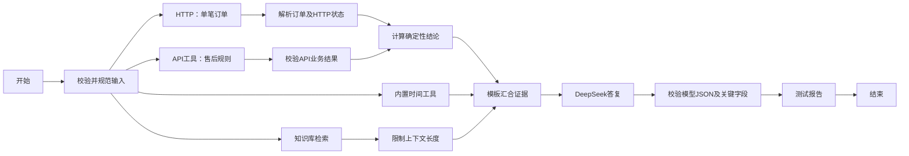

# 售后工单综合测试工作流

这是一份使用虚构订单、可以重复验证结果的工作流。它不执行真实退款。完整图覆盖当前模块支持的 8 类节点，并且每个服务结果都会被下游消费。沿用原示例的知识库 `a07e38ec-8c45-46d1-89e5-cd29643088aa` 和 `deepseek / deepseek-v4-flash`。

目前交付的是文件，没有写入你账号的数据库。API 工具必须先在当前账号创建，才能取得真实 `provider_id`；图里的全零 ID 是明确的占位值，不能直接保存。模型凭证、知识库归属及真实召回尚未验证。

| 文件 | 用途 |
| --- | --- |
| `full.graph.json` | 完整版：15 个节点、17 条边，包含知识库和一次模型调用 |
| `baseline.graph.json` | 基础版：10 个节点，保留 HTTP、自定义 API 工具、内置时间工具、代码和模板，不调用模型或知识库 |
| `fixture_server.py` | 本地固定订单和售后规则服务，默认监听 `127.0.0.1:8765` |
| `api-tool.schema.json` | 当前项目自定义的 Schema 格式，参数类型使用 `str`，不是标准 OpenAPI 3 文档 |
| `prepare.py` | 生成创建请求文件，替换 API 提供者 ID，不访问后端 |
| `debug-input.json` | 可直接粘贴到调试接口的正常输入 |
| `cases.json` | 8 组输入和期望结果 |
| `verify.py` | 本地运行真实工作流图，替换模型、检索和数据库资源绑定的验证脚本 |

## 场景和数据流



固定规则是“已签收且签收不超过 7 天，可申请退货”。代码计算结论，模型负责解释，并必须原样返回订单号与结论。这样能区分变量传错、业务计算错误与模型输出不合格。

HTTP 每次只查询一笔订单，固定服务的响应小于 512 字节。API 工具仅返回一条规则，不依赖有道、搜索服务或第三方密钥。内置工具使用现有 `time/current_time`，唯一不固定的业务外字段是运行时间。

检索最多取 2 条，阈值 0.3；检索后的代码保留原字符数和截断标记，最多向模型传递 1200 字符。这个限制针对模型输入，检索节点自身的原始输出仍会出现在运行记录中。问题最多 500 字符，模型输出上限为 1024 tokens，答复字段要求 1 至 180 字。

## 第一次使用

下面命令均在仓库的 `llmops-api/` 目录运行。后端继续按现有 VS Code `Development (Flask + Celery)` 配置启动；基础设施沿用现有开发环境。

### 1. 启动固定数据服务

单独开一个终端，运行并保持开启：

```bash
python3 examples/workflows/after_sales/fixture_server.py
```

可以请求 `GET http://127.0.0.1:8765/health`，应返回 `{"ok":true,"fixture":"after-sales-v1"}`。

默认按 Flask 在本机运行设计。如果 Flask 在容器或另一台机器，图和 API Schema 中的 `127.0.0.1` 不会指向这台主机，需要另外配置可达地址。若端口被占用，不要停止未知进程；用 `--port` 指定空闲端口，并同时修改两份图的 HTTP URL 和 API Schema 的 server。

### 2. 生成创建请求，注册新 API 工具

从现有工作流或工具资料中选一个有效图标 URL，替换下方文字：

```bash
python3 examples/workflows/after_sales/prepare.py --icon-url '替换为已有的有效图片URL'
```

文件生成到 `/tmp/after-sales-workflow/`。使用你已经登录的 API 客户端，以 JSON 请求体调用以下接口（路径前加你平时使用的后端地址）：

1. `POST /api-tools`，Body 使用 `api-tool.create.json`。这是新增测试工具，不要覆盖旧的有道工具。
2. `GET /api-tools?search_word=售后固定规则测试`，在返回的 `data.list` 中找到新提供者，复制它的 `id`。

创建 API 工具接口只返回成功消息，不返回 ID，所以需要第 2 步。`openapi_schema` 在创建请求中必须是 JSON **字符串**；生成的文件已处理好转义，直接使用整个请求文件即可。无需配置认证请求头。

### 3. 绑定提供者，保存基础工作流

```bash
python3 examples/workflows/after_sales/prepare.py --provider-id '替换为上一步提供者UUID'
```

使用 `/tmp/after-sales-workflow/` 中生成的文件：

1. `POST /workflows`，Body 使用 `baseline.create.json`，记录响应中的 `data.workflow_id`。
2. `POST /workflows/{workflow_id}/draft-graph`，Body 使用 **生成后的** `baseline.graph.json`，顶层直接是 `nodes`、`edges`，不需要额外包裹。
3. `POST /workflows/{workflow_id}/debug`，Body 使用本目录 `debug-input.json`。输入直接放在顶层，不包在 `inputs` 内。

```json
{
  "query": "我的订单可以退货吗？",
  "order_id": "TEST-1001"
}
```

成功时应收到 10 个 `event: workflow` 节点结果，结束节点输出 `decision=return_eligible`、`eligible=true`、`amount=129.9`、`http_status=200` 和非空的 `run_time`。

### 4. 保存完整工作流

重复第 3 步，分别改用 `full.create.json` 和生成后的 `full.graph.json`，创建另一个新工作流。先 GET 草稿，确认知识库 `dataset_ids` 未因账号归属被过滤，再调试。

完整图正常应收到 15 个节点结果。除基础版字段外，还要检查 `llm_valid=true`、`validation_error=""`，并人工读一下 `reply` 是否符合事实。`llm_raw` 保留原始模型输出，方便检查。

`has_context` 只表示检索返回的文本非空，不保证内容相关；原知识库不一定包含售后资料。知识库为空时也允许模型仅使用固定规则答复。若要验证真实知识库内容是否传到模型，请另选原库中能召回的已知问题，查看“限制知识库上下文”和“模板汇合证据”的节点输出。真实知识库检索可能使用 embedding 服务，完整版也会实际调用一次 DeepSeek。

本任务不要求发布工作流。需要发布时，应先确认模型校验字段也通过；当前后端只根据图是否抛错设置 `is_debug_passed`，不会读取 `llm_valid`。

## 测试矩阵

`category` 可省略或传空字符串，规范化节点会使用 `standard`。订单号会去空格并转成大写。所有订单与金额都是固定测试数据。

| 输入或操作 | 预期 |
| --- | --- |
| `TEST-1001` | 已签收 3 天，`return_eligible`，金额 129.9 |
| `TEST-1002` | 已签收 15 天，`manual_review`，金额 59.0 |
| `TEST-1003` | 已发货未签收，`manual_review`，金额 89.0 |
| `TEST-9999` | HTTP 404，`order_not_found`；这是预期业务分支，图应正常到结束节点 |
| `order_id=" test-1001 "` | 输出规范化为 `TEST-1001` |
| `category="missing"` | API 返回 404 JSON；“校验API工具业务结果”抛错，不能走到结束节点 |
| `query="   "` 或超过 500 字符 | 输入规范化节点失败 |
| 缺少 `order_id` | 开始节点失败 |
| 停止固定数据服务后调试 | 网络连接失败，不能生成正常的结束结果 |
| 模型输出非法 JSON、错误订单号或结论 | 图会到结束节点，但 `llm_valid=false`，保留原输出和错误原因 |

并行分支事件的相对顺序不固定，不能按照固定序号认节点；通过节点 ID、title 和 node_type 判断。汇合后的模板应同时拿到订单、规则、时间和检索结果。

HTTP 节点以及 API 工具当前都不会自动把 HTTP 404 转成异常，所以这里显式区分“订单不存在”和“规则服务错误”。`workflow_service.debug_workflow` 当前会捕获执行异常，但不发送明确的失败 SSE 事件；异常测试可能表现为 SSE 提前结束。不能仅凭 HTTP 200 或连接结束认定测试通过，必须检查是否收到结束节点及其校验字段。本示例没有修改这些业务实现。

## 已完成的本地验证

```bash
PYTHONPATH=. .venv/bin/python examples/workflows/after_sales/verify.py
```

验证脚本不加载 Flask 业务应用、不读取 `.env`，也不连接数据库。它使用真实 `WorkflowConfig`、LangGraph 编排、节点运行方法、HTTP 请求、自定义 API 工具请求和内置时间工具；仅替换工具的数据库绑定、检索服务与模型服务，并限制 requests 只能访问临时本地测试端口。

已通过 19 个场景：两份图各 8 个用例，加上完整版的空检索、长上下文截断、非法模型 JSON。正常场景检查每个节点恰好执行一次、结束输出符合预期、小响应上限和流式模型片段拼接。

这不等于真实账号的导入、数据库持久化、知识库召回或 DeepSeek 调用已经通过；这些需按上面的导入步骤在你的环境执行。
